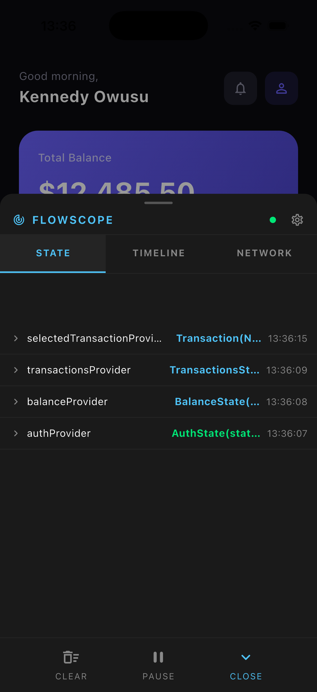
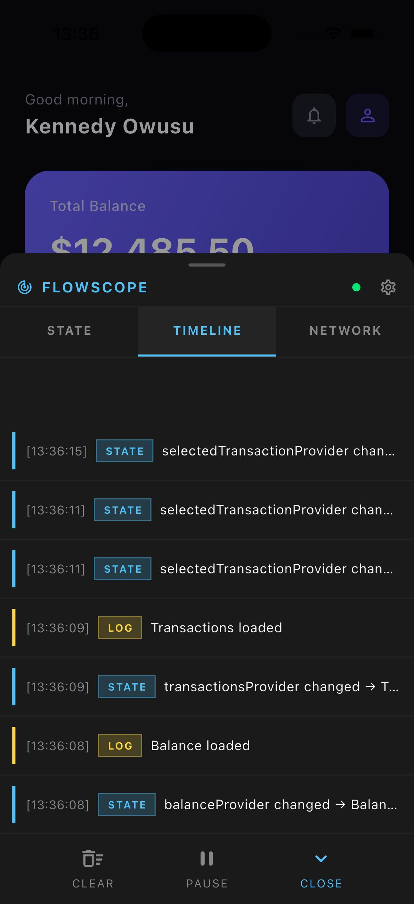
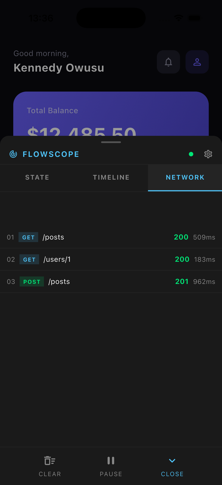

<p align="center">
  
</p>

<h1 align="center">FlowScope</h1>

<p align="center">
  Real-time Flutter debugging SDK. Inspect Riverpod state, network requests, and events from an in-app overlay — without leaving your app.
</p>

<p align="center">
  <a href="https://pub.dev/packages/flowscope">
    
  </a>
  <a href="https://opensource.org/licenses/MIT">
    
  </a>
</p>

---

# FlowScope

Real-time Flutter debugging SDK. Inspect Riverpod state, network requests, and events from an in-app overlay — without leaving your app.

---

## The Problem

You're debugging a Flutter app and something breaks. You don't know:

- Did the state update?
- Did the API return?
- Why didn't the UI change?
- At which step did this flow break?

You end up with scattered `print()` statements and mental reconstruction of what happened. FlowScope solves this.

---

## What It Does

FlowScope gives you three answers in real time:

| Question | Panel |
| --- | --- |
| What is my state right now, and why did it change? | **State** |
| What happened, and in what order? | **Timeline** |
| Did this come from the network or local state? | **Network** |

All visible from a floating overlay inside your running app. No external tools. No context switching.

---

## Installation

```yaml
dependencies:
  flowscope: ^0.1.0
```

---

## Setup

### 1. Wrap your app

```dart
void main() {
  runApp(
    FlowScope(
      child: ProviderScope(
        observers: [FlowScopeObserver()],
        child: MyApp(),
      ),
    ),
  );
}
```

### 2. Add the Dio interceptor

```dart
final dio = Dio();
dio.interceptors.add(FlowScopeDioInterceptor());
```

### 3. Log events manually

```dart
FlowLogger.log('User tapped login');
FlowLogger.log('Something failed', level: FlowLogLevel.error);
```

That's it. Tap the floating button in your app to open the overlay.

---

## Features

### State Inspector

- Live view of every Riverpod provider
- Current value with color coding
- Tap to expand: previous value vs new value (diff view)
- Timestamp of last change

### Event Timeline

- Chronological feed of everything that happened
- Color coded tags: `STATE` `NETWORK` `LOG` `ERROR`
- Newest events first

### Network Inspector

- Every Dio request captured automatically
- Method, endpoint, status code, duration
- Tap to expand: request body, response body
- Color coded: green for 2xx, red for 4xx/5xx

### Overlay Controls

- **Clear** — wipe all captured events
- **Pause** — stop capturing temporarily
- **Close** — collapse back to floating button
- **Draggable** — move the floating button anywhere

---

## Disable in Production

```dart
FlowScope(
  enabled: kDebugMode,
  child: ProviderScope(
    observers: kDebugMode ? [FlowScopeObserver()] : [],
    child: MyApp(),
  ),
)
```

---

### Bloc / Cubit support

FlowScope automatically observes all Blocs and Cubits in your app — no extra setup needed. Just wrap your app with `FlowScope` and all state changes, events and errors will appear in the overlay.

If you want to set the observer manually:

```dart
Bloc.observer = FlowScopeBlocObserver();
```

---

### Screen-aware logging

Add `FlowScopeRouteObserver` to your `navigatorObservers` to tag every event with the screen it occurred on:

```dart
MaterialApp(
  navigatorObservers: [FlowScopeRouteObserver()],
  home: MyHome(),
)
```

Every state change, network call, and log will now show which screen it happened on inside the Timeline panel.

---

## Roadmap

- [ ] Screen-aware logging (attach events to current route)
- [ ] Bloc/Provider support
- [ ] Shake to open gesture
- [ ] Export session as JSON
- [ ] Replay network requests

---

## Screenshots

| | | |
| --- | --- | --- |
|  |  |  |

## Built By

[Kennedy Owusu](https://github.com/kennedyowusu) — built by a Flutter developer who got tired of debugging with print statements.

---

## License

MIT
